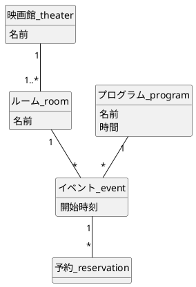
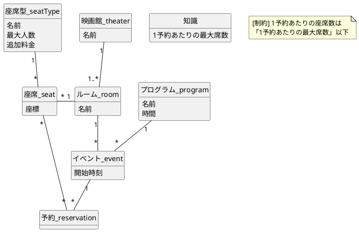
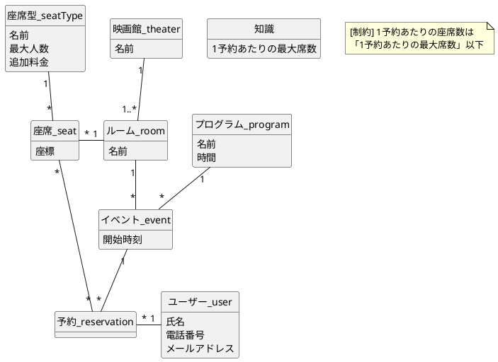
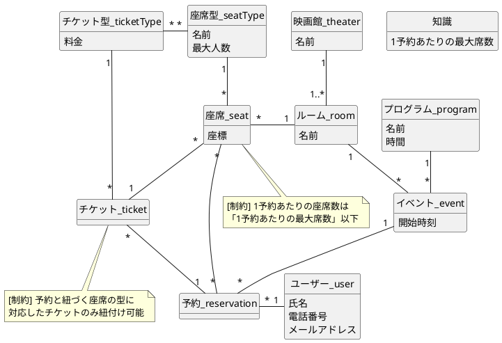
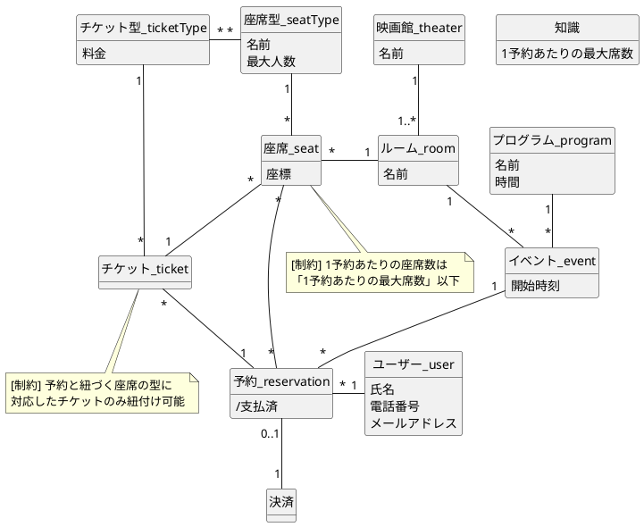
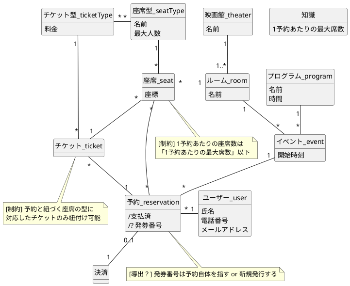
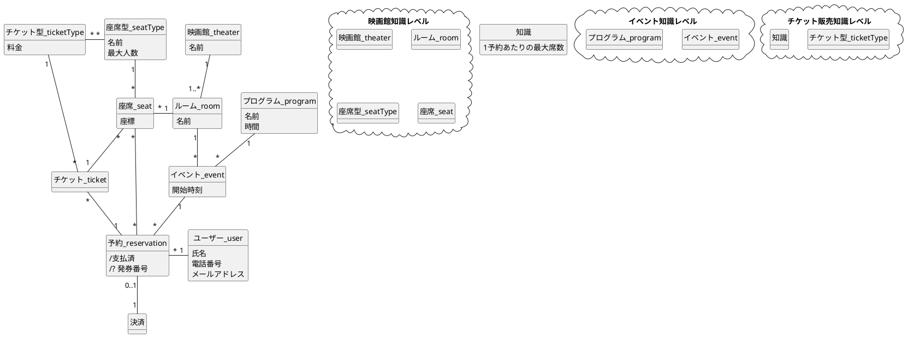

```plantuml

@startuml

hide circle
hide methods
skinparam shadowing false

class 映画館_theater{
  名前
}

@enduml

```

## 概要

概念モデリングの練習として、某映画館のチケット予約システムの概念モデルを作成してみます

## 作成方法

チケットを発行する際のサイトのフローチャートにしたがって、順にモデリングしていきます

### サイトのフローチャート

1. 映画館を選ぶ
2. 作品と日程を選ぶ
3. 座席を選ぶ
4. 購入者の情報を入力する
5. チケットの種類を選ぶ
6. 購入手続きを行う
7. 発券番号が発行される

## Step1: 映画館を選ぶ

系列店で同じシステムを利用することを前提として、それぞれの **映画館** という概念が必要になります。

![image][img1]

:::details plantuml

:::

## Step2: 作品と日程を選ぶ

タイムテーブルの画面から、見たい作品と日程を選択します。画面には

- 作品名
- シアター番号
- 開始時刻
- 上映時間

が表示されていました。映画館は複数のシアターを所有しているため、どのシアターで上映するのかも選択することになります。

ここで悩んだポイントは次です。

- ここで選択している「対象」はなにか
- **シアター** という概念は映画館と部屋、どちらに割り当てるべきか

1 つ目の選択する対象ですが、ここでは **イベント** としました。タイムスケジュールの中の 1 つの予定を何と呼ぶべきかを考えたのですが、結論としては Google カレンダーの英語版で各予定が **event** とされていたところから持ってきました。（ちなみに、日本語版では **予定** と呼ばれていました）

2 つ目のシアターの概念ですが、映画館をシアター、映画館の中の各部屋はルームとすることにしました。本来は、このあたりの議論をドメイン専門家に聞きながらすすめるのがベストかなと思います。

![image][img2]

:::details plantuml

:::

作品について、映画館ではライブビューイングなど、映画以外も扱うことがあることから **プログラム** の 1 つとして捉えることにしました。
また、注文の 1 単位は **予約** と呼ぶことにしました。

## Step3: 座席を選ぶ

選択したルームの座席表が表示され、上限まで席を選択することができます。
ここで、座席には

- プレミアムシート（オプション料金が必要）
- ペア・ファミリーシート（複数人で座ることができる）

という種類があることにします。つまり、座席は **最大人数（キャパシティ）** を持ちます。

![image][img3]

:::details plantuml

:::

座席の **座標** は画面のどこに表示すべきかという情報として、どのような形式になるかわかりませんが入れています。

## Step4: 購入者の情報を入力する

購入者の氏名などを入力する画面です。参考にしたサイトの場合、① ログインしてユーザー登録した情報を使用する、② アカウントを発行せず注文する、という 2 つのルートが有るのですが、そのあたりの処理は汎用的で興味がないので省略します。

![image][img4]

:::details plantuml

:::

## Step5: チケットの種類を選ぶ

チケットの種類（大人、子供、シニアなど）を選択します。選択できるのは、指定した座席に対応する選び方のみになります。

![image][img5]

:::details plantuml

:::

- 座席に追加料金を設定していたのですが、チケット型に持たせました
  - 足し合わせ的に設定しようとしたのですが、詳細がわからない場合はシンプルな方がよいので、料金としてまとめました

## Step6: 購入手続きを行う

各種決済方法で料金を支払います。ここも汎用的なものですので、簡略化してモデリングします。

![image][img6]

:::details plantuml

:::

- 簡略化してわかりづらいと思ったので、予約に **支払済** という導出プロパティのフラグを持たせました

## Step7: 発券番号が発行される

決済が終わると発券番号が発行されます。

![image][img7]

:::details plantuml

:::

**発券番号** は新たに発行するものか、予約エンティティ自体の呼び方（ID）を変えたものか判別がつかなかったため、 `[導出？]` としました。なお、私は概念として重要な役割を持たない限り、各エンティティの ID は省略して書きます。

## 整理

一通り概念を書き出したので、少し整理しておきます

![image][img8]

:::details plantuml

:::

ユーザーの予約によって作成されるエンティティ（操作レベル）は **チケット, 予約, ユーザー, 決済** の 4 つであることがわかりやすくなりました。
もちろん、これが完璧な概念図というわけではないです。例えば、

- チケットはイベントと座席の組合せで定義したほうが良いか？
- 料金はチケットのみで決定して良いか？
- キャンセル、決済失敗の場合も考慮するとどうなるか？

など、考え出すときりがないですが、実際の開発では範囲を区切って行うことが多く、むしろスコープを切らないと延々と概念を広げていくことになるので、きりがないのが当然だと思います。

## まとめ

概念モデリングの練習として、チケット予約システムの概念図を書いてみました。日本語で「予定」と呼ぶことが多い概念を「イベント」とするとしっくりきたのが、個人的には一番大きい収穫でした。

[img1]: https://raw.githubusercontent.com/fuuki/Images/master/20201206-movie-ticket-modeling/1.png
[img2]: https://raw.githubusercontent.com/fuuki/Images/master/20201206-movie-ticket-modeling/2.png
[img3]: https://raw.githubusercontent.com/fuuki/Images/master/20201206-movie-ticket-modeling/3.png
[img4]: https://raw.githubusercontent.com/fuuki/Images/master/20201206-movie-ticket-modeling/4.png
[img5]: https://raw.githubusercontent.com/fuuki/Images/master/20201206-movie-ticket-modeling/5.png
[img6]: https://raw.githubusercontent.com/fuuki/Images/master/20201206-movie-ticket-modeling/6.png
[img7]: https://raw.githubusercontent.com/fuuki/Images/master/20201206-movie-ticket-modeling/7.png
[img8]: https://raw.githubusercontent.com/fuuki/Images/master/20201206-movie-ticket-modeling/8.png
