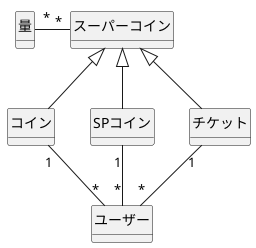
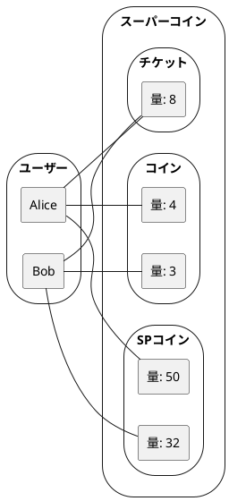
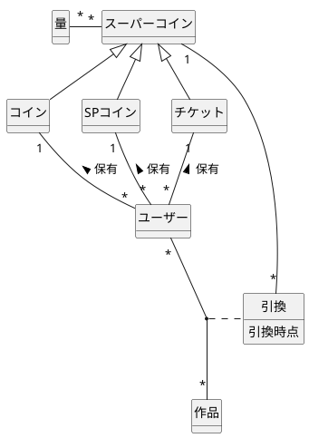
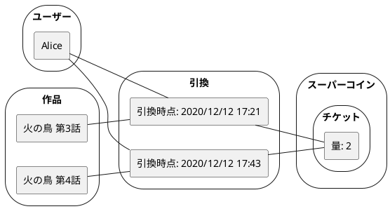
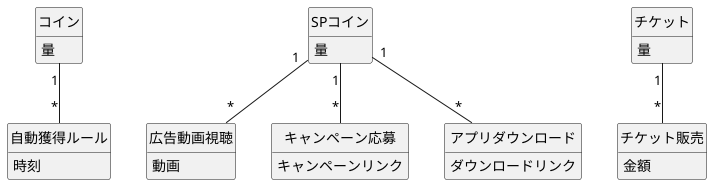
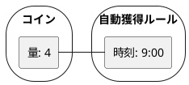
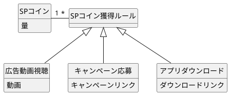
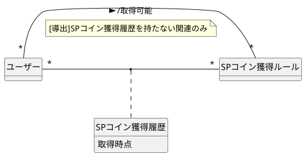
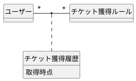

## 概要

概念モデリングの練習として、無料漫画アプリの概念モデルを作成してみます。思ってたより大きくなりそうだったので、複数記事に分けてやっていこうと思います。

（注：私がアプリの開発に関わっているわけではないです）

## 閲覧チケットの概要

- コインを使うことで、漫画を読むことができる
  - コインには 2 種類あり、毎日 9 時に補充されるもの（コイン）と、指定された行動を取ることで得られるもの（SP コイン）がある
- チケットを購入することでも、漫画を読むことができる

ざっくりとこんな感じです。細かい仕様はモデリングしながら補足していきます。

## コイン／チケット関連のモデリング

コイン／チケットが複数種あるので、とりあえず記述します。

:::details plantuml

:::

このアプリにおいて、コインやチケットは漫画と交換する貨幣のような役割を持っています。この貨幣を概念化したかったのですが、名称が全く思いつかなかったので **スーパーコイン** という安直な名前をとりあえずつけました。

ベン図で書くと次のようなイメージです。

:::details plantuml

:::

Alice と Bob はチケットのエンティティ 「量: 8」 を共有していますが、スーパーコインの概念は各コイン・チケットの量を表すのみの概念なので、共有しても問題有りません。これらは、Alice と Bob がチケットを 8 持っているという事実を表す役割のみを持ちます。

このあたりの概念は、DDD の値オブジェクトと同じような考え方だと思います。

### コイン／チケットを使用する

漫画を読む際にコイン／チケットを使用するのですが、1 つの作品を見るのに使用するコイン／チケットは必ず 1 種類で、1 度に 2 以上消費することもあります。

:::details plantuml

:::

これをベン図で例示すると、次のようになります。
これは、「Alice がチケットを 2 ずつ消費（つまり、2x2=4 消費）して、火の鳥の 第 3 話、第 4 話 を引換した」ことを表します。

:::details plantuml

:::

### コイン／チケットを獲得する

それぞれの獲得方法は次のとおりです。

| 種類      | 獲得方法                                 |
| --------- | ---------------------------------------- |
| コイン    | 毎日 9 時に自動的に 4 になる             |
| SP コイン | 広告動画視聴などの特定の行動によって獲得 |
| チケット  | 購入することで獲得                       |

まずは、各獲得方法を愚直に記述してみます。

![image][img5]

:::details plantuml

:::

それぞれを詳しく見ていきます。

#### コイン

「毎日 9 時に自動的に 4 になる」ので、以下のようなベン図で表されるはずです。

:::details plantuml

:::

自動獲得ルールのエンティティは 1 つのみになりそうですが、システムで扱う概念を記述するのが目的なので、これも型として扱います。

#### SP コイン

こちらは獲得方法が複数あります。動画視聴やアプリダウンロードなど、それぞれ処理が異なることが想定されます。また、その処理のために使用する属性も異なるため、継承により実現する必要がありそうです。

:::details plantuml

:::

#### チケット

チケットは購入によって獲得するため、価格を設定します。

### 獲得履歴

#### SP コインの獲得履歴

ユーザーは、SP コインは 1 つの獲得ルールにつき 1 度ずつしか適用されないため、履歴を保つ必要があります。履歴を持たないもののみ **取得可能** として定義します。

:::details plantuml

:::

### チケットの獲得履歴

同様に、チケットも購入履歴を閲覧できるようにします。

:::details plantuml

:::

## つづく

もう少し汎化できる気もしたのですが、それぞれのコイン／チケットは明確にことなる獲得方法を持っているため、獲得についてはあまり汎化する必要はないかなと思いました。

次は漫画のジャンル分けなどをやってみたいと思います。

[img1]: https://raw.githubusercontent.com/fuuki/Images/master/20201211-manga-app-modeling/1.png
[img2]: https://raw.githubusercontent.com/fuuki/Images/master/20201211-manga-app-modeling/2.png
[img3]: https://raw.githubusercontent.com/fuuki/Images/master/20201211-manga-app-modeling/3.png
[img4]: https://raw.githubusercontent.com/fuuki/Images/master/20201211-manga-app-modeling/4.png
[img5]: https://raw.githubusercontent.com/fuuki/Images/master/20201211-manga-app-modeling/5.png
[img6]: https://raw.githubusercontent.com/fuuki/Images/master/20201211-manga-app-modeling/6.png
[img7]: https://raw.githubusercontent.com/fuuki/Images/master/20201211-manga-app-modeling/7.png
[img8]: https://raw.githubusercontent.com/fuuki/Images/master/20201211-manga-app-modeling/8.png
[img9]: https://raw.githubusercontent.com/fuuki/Images/master/20201211-manga-app-modeling/9.png
