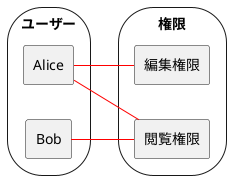
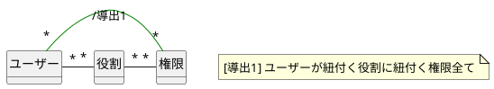
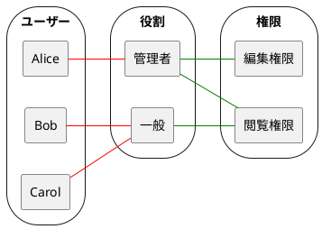
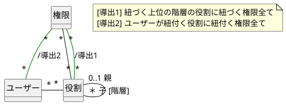
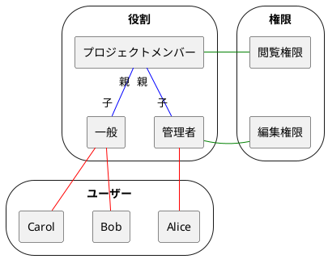
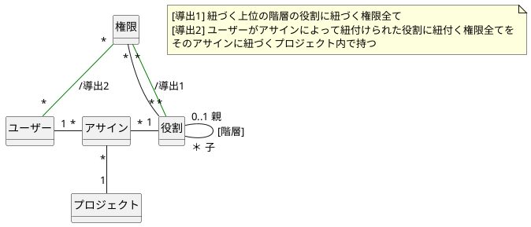
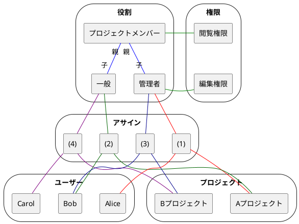

```plantuml

@startuml

hide class circle
hide class methods
skinparam shadowing false

ユーザー "*"-"*" 権限

@enduml

```

## 概要

ユーザーに権限を与えるパターンをまとめてみました。
何かしらのシステムの編集、閲覧権限を例にあげています。

## 個人へ直接付与

ユーザー個人へ直接紐付けるパターンです。

#### クラス図

:::details plantuml

:::

#### ベン図

:::details plantuml

:::

上のベン図は

- Alice が編集・閲覧権限を持つ
- Bob が閲覧権限のみを持つ

ことを表現しています。ただし、このように個人に直接権限を紐付けることはあまりないと思います。

## 役割への付与

ユーザーが紐づく役割に権限を付与することで、ユーザーの持つ役割を導出させるパターンです。

#### クラス図

![image][img3]

:::details plantuml

:::

#### ベン図

:::details plantuml

:::

上のベン図は

- 管理者は編集・閲覧権限を持つ
- 一般ユーザーは閲覧権限を持つ
- Alice は管理者であるから、編集・閲覧権限を持つ
- Bob, Carol は一般のユーザーであるから、閲覧権限のみを持つ

ことを表しています。個人へ直接付与する場合と比べ、権限を持つ理由が「役割」にあることが明確化されることで、ユーザーの変化に柔軟なモデルになっています。

## 役割の構造化

役割を構造化することで、権限が付与される理由を明確化していきます。

#### クラス図

![image][img5]

:::details plantuml

:::

#### ベン図

:::details plantuml

:::

上のベン図は

- 管理者は編集権限を持ち、プロジェクトメンバーであるから閲覧権限も持つ
- 一般ユーザーはプロジェクトメンバーであるから閲覧権限も持つ
- Alice は管理者であるから、編集・閲覧権限を持つ
- Bob, Carol は一般のユーザーであるから、閲覧権限のみを持つ

ことを表しています。閲覧権限を持つ理由が「プロジェクトメンバー」であることが明確化されました。

## 役割の持たせ方の構造化

ユーザーが役割を持つ理由を記述することで、さらなる明確化をしてみます。

#### クラス図

![image][img7]

:::details plantuml

:::

#### ベン図

![image][img8]

:::details plantuml

:::

上のベン図は

- 管理者は編集権限を持ち、プロジェクトメンバーであるから閲覧権限も持つ
- 一般ユーザーはプロジェクトメンバーであるから閲覧権限も持つ
- (1)により、Alice は A プロジェクトに管理者としてアサインされているため、A プロジェクトの閲覧・編集権限を持つ
- (2)により、Bob は A プロジェクトに一般のユーザーとしてアサインされているため、A プロジェクトの閲覧権限を持つ
- (3)により、Bob は B プロジェクトに管理者としてアサインされているため、B プロジェクトの閲覧・編集権限を持つ
- (4)により、Carol は B プロジェクトに一般のユーザーとしてアサインされているため、B プロジェクトの閲覧権限を持つ

ことを表しています。

## さらにモデリングする

権限の持たせ方のモデリングをしてきましたが、ユーザーが権限を持つ場合、その理由とセットでモデリングすることで明確化ができます。
役割のモデリングについては、アナリシスパターン[^ref-ap]の第 2 章「責任関係」を参考にしました。さらなるモデリングを行う場合はこちらを参考にするとよいと思います。

ただし、アナリシスパターンの p.13 に

> **モデリングの原則** モデルは正しいか誤っているかではなく、使いやすいか使いにくいかである。

とあるように、事実を細かいところまで完全に表現するのではなく、ユースケースやドメインに沿って使いやすいモデルを選択することが重要だと思います。

[^ref-ap]: Martin Fowler (2002) アナリシスパターン: 再利用可能なオブジェクトモデル, ピアソンエデュケーション

[img1]: https://raw.githubusercontent.com/fuuki/Images/master/20201220-permission-modeling/1.png
[img2]: https://raw.githubusercontent.com/fuuki/Images/master/20201220-permission-modeling/2.png
[img3]: https://raw.githubusercontent.com/fuuki/Images/master/20201220-permission-modeling/3.png
[img4]: https://raw.githubusercontent.com/fuuki/Images/master/20201220-permission-modeling/4.png
[img5]: https://raw.githubusercontent.com/fuuki/Images/master/20201220-permission-modeling/5.png
[img6]: https://raw.githubusercontent.com/fuuki/Images/master/20201220-permission-modeling/6.png
[img7]: https://raw.githubusercontent.com/fuuki/Images/master/20201220-permission-modeling/7.png
[img8]: https://raw.githubusercontent.com/fuuki/Images/master/20201220-permission-modeling/8.png
